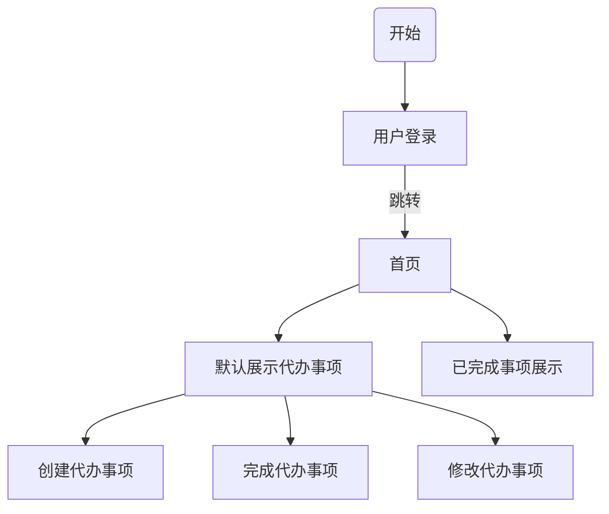

# **ToDoList**

## 业务流程



## 表结构设计

```sql
create database if not exists todolist;
```

### 项目表

字段名：id，program_name，program_content，create_time，update_time，status，user_id，num

字段描述：id，项目名称，项目内容，创建时间，更新时间，状态，用户id，序号

sql：

```sql
create table if not exists todolist.program (
	id bigint(20) not null auto_increment,
    program_name varchar(255) not null,
    program_content text not null,
    create_time datetime,
    update_time datetime,
    status int(1) not null,
    user_id bigint(20) not null,
    num int(10),
    primary key (id))
engine=InnoDB default charset=utf8;
```


### 用户表

字段名：id，user_name，password，create_time，update_time，status

字段描述：id，用户名，密码，创建时间，修改时间，状态

sql：

```sql
create table if not exists todolist.user (
	id bigint(20) not null auto_increment,
    user_name varchar(50) not null,
    password varchar(255) not null,
    create_time datetime,
    update_time datetime,
    status int(1) not null,
    primary key (id))
engine=InnoDB default charset=utf8;
```

​			

### 事项表

字段名：id、item_name、item_content、level、create_time、update_time、dead_line、status、parent_id、user_id

字段描述：id、事项名称、事项内容、优先级、创建时间、修改时间、截止时间、状态、父项id、用户id

sql：

```sql
create table if not exists todolist.item (
	id bigint(20) not null auto_increment,
    item_name varchar(255) not null,
    item_content text not null,
    level int(1) not null,
    create_time datetime,
    update_time datetime,
    dead_line datetime,
    status int(1) not null,
    parent_id bigint(20),
    user_id bigint(20) not null,
    primary key (id))
engine=InnoDB default charset=utf8;
```

## 搭建项目框架

使用技术：SpringBoot、MyBatis、MySQL、SpringSecurity、Lombok、Thymeleaf

开发环境：

JDK：1.8

MySQL：5.7.27

